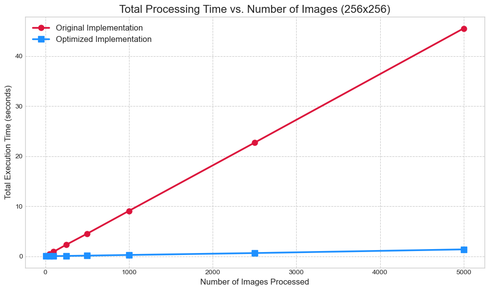

# thresholding

This is the Git repository for adaptive thresholding code based on the paper [Adaptive image thresholding and localization of point spread functions with enhanced precision for single molecule localization based super-resolution microscopy](https://doi.org/10.1016/j.optlaseng.2024.108234).

## Setting up

The program was developed in Python 3.8.8, and tested on Python 3.12.7. Later versions of Python should be supported but have not been tested yet.
If you are on a later version, give it a try!

I would suggest you use [Anaconda](https://www.anaconda.com/download/success) / Miniconda and set up a virtual environment as:

- conda create -n "myenv" python=3.8.8 # replace "myenv" with your desired name.

After setting up the virtual environment, you can install the dependencies as:

- pip install -r requirements.txt

## Usage

- Input : image (numpy.ndarray): Input image for threshold calculation.
- Returns: optimal_threshold (int): Optimal threshold value for image segmentation.

## Points to be noted:

- It is a global thresholding method based on the entropy of the pixel values of the image.
- If the processing speed is slow, convert the image into 8-bit grayscale before processing.


## Update 25 August 2025:
- An optimised version of the code is added to the respository as: "adaptive_thresholding_optimized.py". Use it for convenience.
- The time performance of the optimized vs the opriginal implementation is shown in the graph. 


If you use this code in your research, please cite the original paper:

```
@article{choudhury2024adaptive,
	title        = {Adaptive image thresholding and localization of point spread functions with enhanced precision for single molecule localization based super-resolution microscopy},
	author       = {Choudhury, Pranjal and Boruah, Bosanta R},
	year         = 2024,
	journal      = {Optics and Lasers in Engineering},
	publisher    = {Elsevier},
	volume       = 178,
	pages        = 108234
}
```
Thank you,

Pranjal Choudhury
